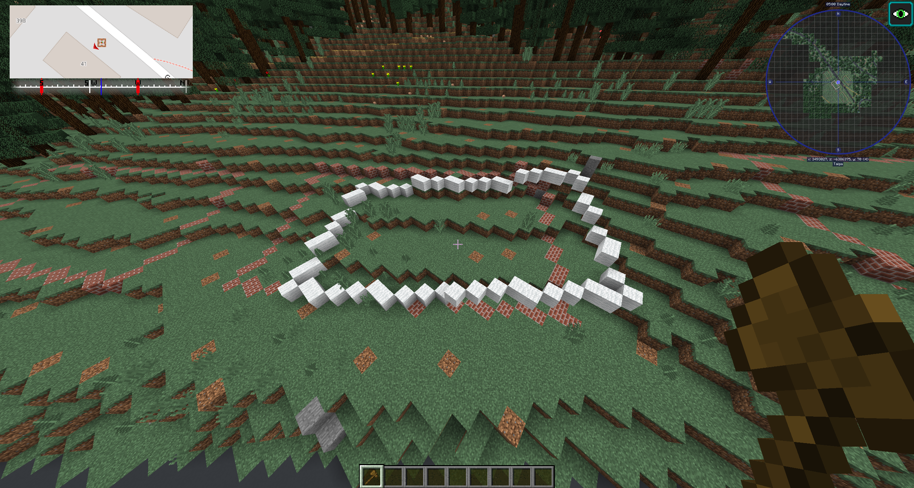

# Building Guidebook

## Constructing Buildings

In this part of the guidebook, we go step by step showing you how to make any building. Whether it's a house, factory, shopping mall, or even skyscraper. They all use the same technique when building.

## Teleporting with TPLL

To travel to different places in the world we will use the TPLL command. This command takes real-world coordinates and using some mathematical equations converts this to the corresponding location in the BTE world, and then teleports you there.

Here is how you use it:

1. Open Google Maps by clicking [here](https://www.google.com/maps)
2. Use the search bar (write in an address/location and press enter) to find the building you want to build test

3. Navigate the map by dragging and scrolling

4. After navigating to your location, right-click a specific spot where you will teleport to

   

5. Left-click the coordinates in the first row in the pop-up

   

6. In Minecraft, write "/tpll" then press `CTRL + V` to paste the coordinates, then press `Enter`

   

7. After waiting for a bit, you will be teleported to your location!

   

## Making the shell part 1: Making the building outline

The first step to making any building is building the building footprint, or what we call the outline. By making this first, we can extend these into walls and then make a roof on top.

If you have watched some of PippenFTS' old videos you might wonder "Why not just use the brick outline?". In later times we found out that the brick outlines were not accurate, and therefore we make our own.

Here is how you do it:

### With 3D data

 1. In Google Maps, go to one of the buildings you want to build

 2. Hover over Layers in the bottom-left area of your map.

    

 3. Click on More.

    

 4. Click on Satellite and ensure that Globe View is checked. You can now get an angled view by holding shift while dragging. If you still see flat buildings go down to [Without 3D data](#without-3d-data) below

    

 5. Remove all nearby trees with the command `//replacenear 40 log,leaves air`

    

 6. Use the TPLL command you used above to teleport to each corner of the building, and make sure to place a block where you land in Minecraft.

    

    

 7. In Minecraft, do the command `//wand`. This should give you a wooden axe

    

 8. With your axe in hand, left click one of the blocks you placed, then right click one of the blocks next to it.

    

    

 9. Execute the command `//line (block of choice)` (Note: Minecraft block id's are quite different in 1.12, go to [this list](https://minecraft-ids.grahamedgecombe.com/) to see a list of id's).

    

10. Now do this with all the points so that you have a full shape. To get rid of the selection box do `//desel`. Note: If you are wondering why the outline is not straight: Most buildings are not on a straight north-south rotation, in additon to the BTE map having a weird rotation some places. This means that we have to build them diagonally, but don't worry, it's not as hard as you think. [Here is an interesting video from PippenFTS about the problem](https://www.youtube.com/watch?v=5o8Psc6FvZ4&pp=ygUYYnVpbGQgc3RyYWlnaHQgcGlwcGVuZnRz)

    

11. If your building is on varying terrain, you should place blocks under the outline so that it goes all the way to the ground. You can do this manually or with commands. To do this with world edit, make a selection surrounding the whole building, then expand it so that it reaches the top of the outline with `//expand (amount of blocks) up`. Now create a mask which makes it so commands only affect air blocks with `//gmask air`. Now do the command `//replace <(block of choice) (block of choice)` until the outline has reached the bottom.

### Without 3D data

1. Turn off 3d
2. Find corner, tpll top and bottom point
3. In Minecraft copy the difference in blocks
4. Tpll rest of points and use //paste
5. Follow steps from above

## Making the shell part 2: Making the building walls

### With 3D data

1. Download google earth
2. Go to building
3. Find difference in elevataion to get height
4. In minecraft make selection
5. Expand selection
6. Replace above until reached height

### Without 3D data

#### With streetview

1. Go into streetview, if you dont have go down.
2. Estimate with windows/doors
3. Follow steps from above

#### Without streetview

1. Technique 1: Find videos or images online
2. Technique 2: Go back in date in google earth and estimate with windows/doors
3. Follow stepts from above

## Making the shell part 3: Making the building roof

### With 3D data

1. Create layer above outline
2. TPLL to roof points
3. //line the edges
4. connect top to bottom layer

### Without 3D data

1. Create layer above outline
2. Estimate block difference
3. Follow steps from above

## Making windows and doors

### With 3D data

1. For doors, tpll and place. IF u have streetviw make it like it is
2. For windows, find the height of them with google earth
3. Tpll to left and right most window, use math to find the spacing.
4. Place the windows, chea a little bit maybe.

### Without 3D data

1. For doors if you have streetview, estimate where it is and place. IF you dont have streetview estimate like from above
2. For windows, estimate height, place block for marker.  IF you dont have streetview estimate like from above
3. Estimate position, use math
4. Place windows, cheat a little maybe

## Coloring

### With streetview

### Without streetview

## Adding details

### With streetview

### Without streetview

## Constructing Roads

## Constructing Forests

## Constructing Fields

