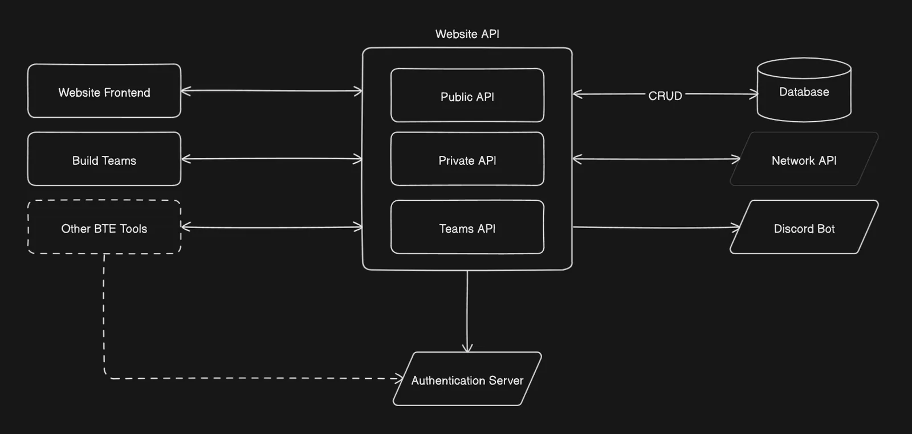

# Permissions

There are multiple way how you can have access to Build Team specific settings:

1. Global Permissions - Build Team Managers and Administrators
2. Manager Permissions - Build Team Staff and Co-Leaders
3. Owner - Build Team Owner (There can only be one Build Team owner, co owners should recive Manage Permissions instead)

The BuildTheEarth website is build around a permission-based System. This means there are no hard-coded roles anymore. Each member of your Team can recive additional Permissions to their Builder Status. With these permissions they can optain specific rights.
Below is a list of all aviable permissions that a member of your Team can have:

| Permission               | Description                          |
|--------------------------|--------------------------------------|
| permission.add           | Add a permission to someone          |
| permission.remove        | Remove a permission from someone     |
| team.application.edit    | Edit Application Questions           |
| team.application.list    | View a list of all Applications      |
| team.application.review  | Review Applications                  |
| team.socials.edit        | Edit Social Links                    |
| team.settings.edit       | Edit Settings                        |
| team.showcases.edit      | Edit Showcase Images                 |
| team.application.notify  | Be notified of new Applications      |
| team.application.blocked | Blocked from submitting Applications |

:::note team.application.blocked

This Permissions is there to block potential application spammers. Activating it on a user will remove his rights for applications. Do not give this to your actual managers.

:::

An example setup of your permissios may look like this:

| Discord Role      | Permissions                                                           |
|-------------------|-----------------------------------------------------------------------|
| Administrator     | All Permissions                                                       |
| Reviewer          | team.application.list, team.application.review, team.application.notify |
| Social Media Team | team.socials.edit                                                     |
| All Staff members | team.showcases.edit                                                   |

To edit permissions of your Team members you can go to the "Members" category of your Team Settings. There you can find two tables, the "Managers" table and "Builders" table. 
Managers are all users which have more permissions than the default Builder permissions (create claims).

# Settings

All Settings can be changed with the team.settings.edit permission. Changes will be reflected instantly, if not they should update within 15 Minutes. 
Some special settings:
* Slug: The short name of the server, which is used in the URL. If possible this should be the country code of your country. 
* Location: A comma seperated list of country codes, including: glb -> Globe and ost -> Oversea Territories
* Minecraft IP: You IP, if you set it to buildtheearth.net the website will use your slug as a template for the /bt < id > command

Dont forget to save your settings!

# Application Questions

The new website features a more flexible application system. You can configure Application Questions with different Input types for Trial and Builder applications seperately.
In the Dialog boxes for each Question you will also see an example of how the question will look on the Form itself.
As a form of styling you can add icons to each question, a list of avaible icons can be found at [tabler/icons](https://tabler.io/icons). If you want to remove the icon, delete everything in the Icon Input. Some question types will also allow for additional information to validate input data before submission.
Dont forget to save your settings!

# Reviewing

Some changes have been made to the review process on the new website. This includes the removal of the "claimed" state of applications. Multiple people can review one application at the same time without blocking each other. You can also change the review status of an application after the initial status change. 
Note that this will also remove the users builder's role on discord.

:::note Reasons

You can still enter a rejection reason for applications, the form will appear when you press the reject button

:::

# Showcase Images

You can upload images of built places to be showcased on the Gallery and Main page of the Website. These images will rotate randomly every 2 minutes. 
If you want to add an image, please input the name of the location in the format of `[Building], [City]` (Or only `[City]`) . The Date should be the Date of Construction, not your uploading date.

# API

The new website now supports an API. Documentation can be found at [https://buildtheearth.github.io/website-node-backend/](https://buildtheearth.github.io/website-node-backend/). There are three components of the API:

1. **Public API:** Data that can be accessed without needing to sign in or providing a token. For example [/api/v1/buildteams](https://api.buildtheearth.net/api/v1/buildteams) or [/api/v1/faq](https://api.buildtheearth.net/api/v1/faq)
2. **Private API:** All routes in this part of the API are only accessable with a valid access_token from Keycloak and the correct [permissions](#permissions). This is so only registered users can manipulate data.
3. **Teams API:** These routes can be accessed with your BuildTeam Token and work the same way as Private Routes, but only for your BuildTeam. They dont require additional permissions. Use these for integration into your website or other systems.