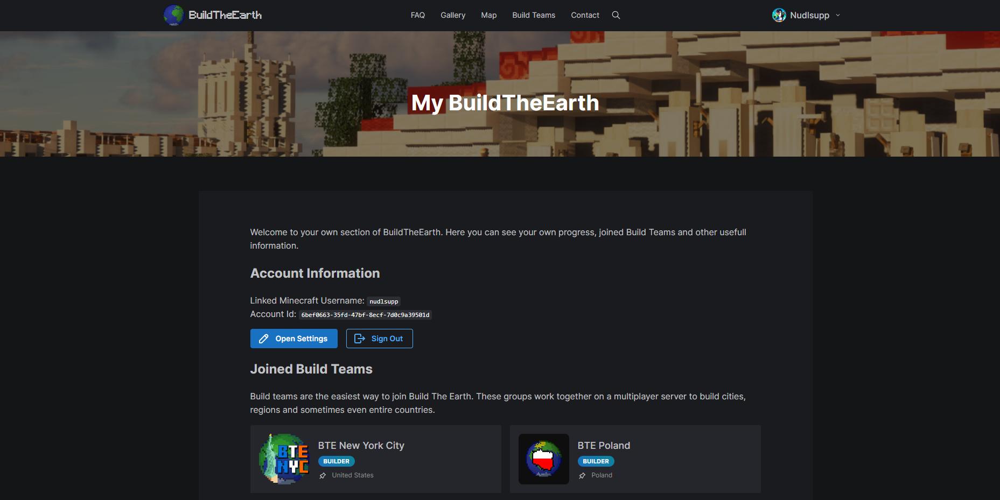

You can access your My BuildTheEarth Page when you are signed in at [https://buildtheearth.net/me](https://buildtheearth.net/me) or by clicking on your account and selecting "My BuildTheEarth".

On the My BuildTheEarth page you can find details about your status at BuildTheEarth, for example all Build Teams you have joined or are a Manager of. You can also view all claims associated with your account on the bottom and create new ones.

:::note Claims

Not all Build Teams allow their members to create Claims by themselfes on the website, this is why some Teams will be grayed-out when you open the "Create new Claim" dialog. Most of those teams will implement a System to reflect their own Claim map onto the BuildTheEarth Website.

:::

On your My BuildTheEarth page you can also optain your **User ID**, which your Team Owner may need to give you the Manager role on the Build Team.

You can also change various settings and profile details when clicking on the "Open Settings" Button. Note that you do not need to enter your First and Last Name. We only require you to choose an username and email address. Your username should reflect the one you have on Discord.