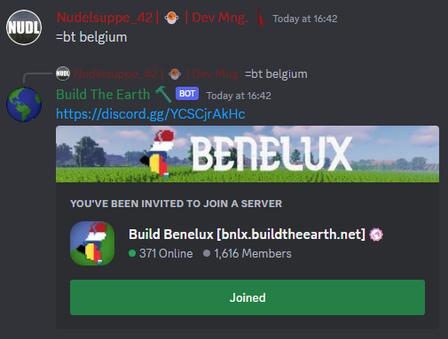

# Becoming a builder

To become a builder you need to join a Build Team.
Build Teams are groups of people working on specific areas. Most teams focus on one country, but some also work on multiple countries or only a city.
To find the correct team for your country you can follow either one of these methods:

1. Run the `=bt <country>` command on our [Discord Server](https://discord.gg/buildtheearth):
   
2. Find the buildteam by [searching on our Website](https://buildtheearth.net/teams).

## Differences between Build Teams

Each Build Team has its own rules and processes how the application process works. You should get familiar with their setup in the information channels of the respective discord server.
Some Teams may require you to download the __BuildTheEarth 1.12.2 Modpack__ (See [The Modpack](the-modpack)) or their own custm modpack for their server Version.

## Application Systems

There are a few different application systems used by different Build Teams. We will describe the most common ones in more detail below.

### Trial System

The trial system involves building on a Build Team Server. You first need to get a trial role that grants you access to build in a confined area. Then you build 1 or 2 buildings to use in your builder application. In total you need to apply two times.

:::info Whats a Trial?

"Trial" is the short form of "Trial Builder". They are people who are currently building their buildings they need for a builder application on the Build Team's Server. The time of how long you can be a Trial can be limited depending on the Build Team.

:::

The process generally works like this:

1. Join the Discord server of the team you want to join.
2. Apply to become a so called "Trial"
3. As soon as you recieve your role, join the Team's Minecraft Server
4. Build 1 to 2 buldings (depending on the Team).
5. Take pictures of the building/buildings in Minecraft by pressing F2. Then upload them to [imgur.com](https://imgur.com/) to get a link for the pictures.
6. Take pictures of the building/buildings in real life. Some teams will want streetview images, some will want Google Earth images, some will want the google link, and some will want the coordinates. You can upload these to the same imgur.com post.
7. Fill out the application for your build team. This is usually done on the team's Discord or on [the website](https://buildtheearth.net/teams)

### Plot System

The Plot System lets you build directly on the Build Team Server without the need of applying to become a builder. All buildings you build there are directly pasted into the Minecraft world after they get accepted by a reviewer. After you have built one or two building (or "Plots") you can also apply to become a builder with these buildings.

### Singleplayer Application

Another common form of application is the Singleplayer Application. This application works the same was as the [Trial Application](#trial-system), only that you do not need to apply two times to the Build Team and you can spend as much time as you need to build your buildings. This is done in your local Singleplayer world. After you have been accepted to the Build Team you can transfer your buildings onto the server and continue building there.